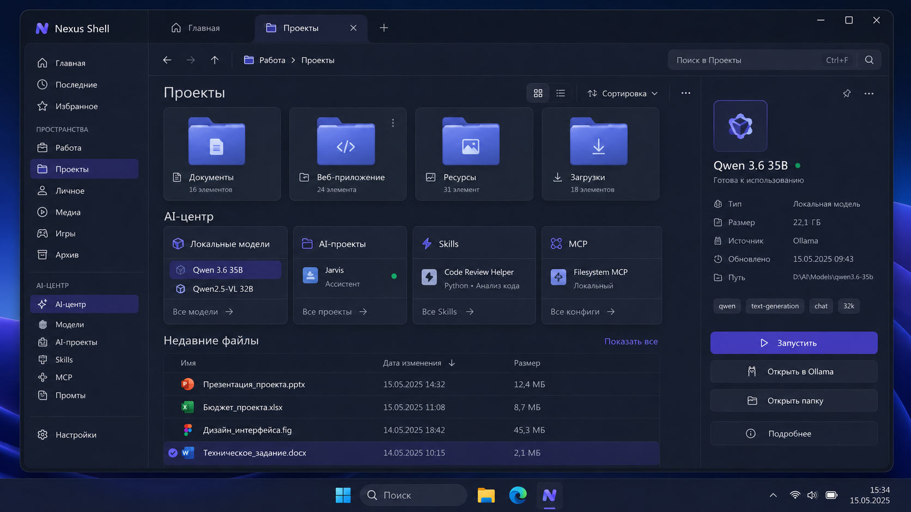

# Nexus Shell



**Nexus Shell** — нативный файловый менеджер и органайзер для Windows 11,
который задуман как основной интерфейс для ежедневной работы с файлами,
приложениями, играми и локальными AI-проектами. Он не заменяет системную
оболочку Windows и всегда оставляет стандартный Проводник аварийным вариантом.

> **Состояние разработки на 02.08.2026:** версия 0.8.0 проходит Release-сборку,
> полный набор регрессионных проверок и безопасный smoke-тест Корзины.
> Установщик собирается self-contained, но остаётся неподписанным до появления
> сертификата Code Signing. Каталог `outputs` не хранится в Git: бинарный релиз
> необходимо прикладывать к GitHub Releases отдельно или собирать локально.

Интерфейс следует спокойному направлению Windows 11: тёмные матовые поверхности,
много свободного пространства, высокая читаемость и один сине-фиолетовый
акцент. Два изображения в `design/` описывают разные вкладки и оба считаются
визуальными референсами проекта.

## Что уже работает

- главная «Проекты» с реальными счётчиками файлов;
- отдельная вкладка «Файлы» по компактному референсу, открываемая кнопкой `+`;
- группа «Хранилища» с компьютером, документами, загрузками и Корзиной;
- пространства и быстрые переходы к пользовательским папкам;
- отдельная библиотека «Игры» с обнаружением Steam, Epic Games, Xbox и локальных portable/repack-установок;
- распознавание `.torrent` независимо от торрент-клиента и связь метаданных с фактической папкой установленной игры;
- автоматический поиск локальных игр в стандартных папках на дисках и добавление любой своей папки;
- реальные обложки Steam и системные иконки локальных игр;
- запуск игры, просмотр файлов прямо в Nexus, скрытие из библиотеки и безопасное удаление локальной папки через Корзину;
- для Steam, Epic Games и Xbox кнопка удаления открывает системное управление установленными приложениями;
- отдельная библиотека «Приложения» с настоящими значками ярлыков из меню «Пуск»;
- нативные эскизы изображений и системные иконки файлов, папок и приложений;
- системные компоненты Steam и папки сохранений не выдаются за установленные игры;
- постоянное «Избранное», сохраняющее файлы и папки между запусками;
- физический «Архив Nexus» внутри пользовательских Документов;
- асинхронная навигация по папкам и дискам;
- поиск внутри открытой папки, список и сетка;
- рабочая адресная строка `Ctrl+L` и сортировка по имени, дате, типу и размеру;
- мультивыбор файлов и папок;
- создание папок, переименование, копирование, вырезание и вставка;
- общий с Проводником системный буфер обмена и копирование перетаскиванием;
- контекстное меню основных файловых команд;
- удаление только через Корзину Windows и после подтверждения;
- свойства выбранного элемента и копирование пути;
- горячие клавиши Проводника: `Ctrl+C`, `Ctrl+X`, `Ctrl+V`, `F2`, `Delete`, `Ctrl+A`, `Ctrl+Shift+N`;
- рабочая вкладка «Файлы» открывается через `+` или `Ctrl+T` и закрывается через `Ctrl+W`;
- недавние файлы и предпросмотр изображений;
- открытие файлов системным приложением;
- обнаружение локальных Ollama-моделей, AI-проектов, Codex Skills и MCP;
- безопасные предложения по организации файлов в «Загрузках»;
- применение одного предложенного перемещения только после подтверждения;
- отмена последнего подтверждённого перемещения;
- аварийное открытие стандартного Проводника.

## Границы первой версии

- приложение не изменяет системную оболочку Windows;
- не отключает `explorer.exe`;
- никогда не перемещает файл без отдельного подтверждения;
- обычные файловые команды выполняются только по прямому действию пользователя;
- удаление всегда направляется в Корзину;
- не запускает фоновую автоматическую сортировку;
- не трогает `Windows`, `Program Files`, `AppData` и установленные приложения;
- использует стандартный Проводник только как аварийный путь.

Nexus пока нельзя считать полной копией всех системных возможностей Explorer.
Не завершены расширения оболочки, сложные сетевые сценарии, полноценная работа
со всеми форматами архивов, системные страницы разрешений и цифровая подпись
релиза. Пользовательские библиотеки игр и AI-проектов требуют проверки на
реальном наборе данных после каждого изменения эвристик обнаружения.

Копирование и перемещение показывают подробный прогресс, скорость, паузу,
отмену и безопасный выбор при конфликте имён. Постоянный журнал действий,
сетевые учётные данные и глубокая системная интеграция оставлены для следующих этапов.

## Установка

Репозиторий содержит исходный код. После контролируемой локальной релизной
пересборки запустите:

```text
outputs\NexusShell-Setup-0.8.0-x64.exe
```

Этот путь существует только на машине, где выполнена сборка: `outputs/`
намеренно исключён из Git. Если для версии опубликован GitHub Release,
используйте приложенный к нему установщик и сверьте SHA-256.

Установщик Inno Setup ставит приложение строго для текущего пользователя,
создаёт ярлык в меню «Пуск», по выбору — ярлык на рабочем столе и автозапуск
при входе, и добавляет Nexus Shell в список установленных приложений Windows.
Права администратора не требуются. Windows App Runtime и .NET отдельно
устанавливать не нужно.

Payload каждой версии находится в отдельном каталоге, например:

```text
%LocalAppData%\Programs\Nexus Shell\app-0.8.0
```

При обновлении Nexus сначала устанавливает новую версию и переключает ярлыки.
Старый каталог удаляется только при наличии валидного marker-файла Nexus,
строгого имени `app-X.Y.Z`, совпадающей версии и `Nexus.App.exe`. Неотмеченные
каталоги и прежняя плоская структура 0.6.0 сохраняются: установщик не пытается
угадывать владение файлами в пользовательском каталоге. Настройки, избранное,
список игровых папок и логи находятся вне каталога программы.

> Старые установщики 0.7.0 и ниже не соответствуют текущему коду и не должны
> распространяться как актуальная версия.

## Сборка

Для разработки требуется Windows 11 и .NET 8 SDK. Отдельная установка Windows App Runtime для запуска не нужна: приложение собирается в самодостаточном режиме Windows App SDK.

```powershell
dotnet restore NexusShell.sln --configfile NuGet.Config
dotnet build NexusShell.sln --no-restore
```

Обязательный консольный regression harness:

```powershell
dotnet run `
  --project tests/Nexus.Core.Tests/Nexus.Core.Tests.csproj `
  -c Release `
  --no-build `
  --no-restore `
  -p:NuGetAudit=false
```

`Nexus.Core.Tests` — не VSTest-проект. Команда `dotnet test` может завершиться
успешно, не запустив эти проверки, и не является достаточным quality gate.

Безопасный read-only smoke-тест Корзины:

```powershell
dotnet run `
  --project tests/Nexus.RecycleBin.SmokeTests/Nexus.RecycleBin.SmokeTests.csproj `
  -c Release `
  --no-build `
  --no-restore `
  -p:NuGetAudit=false
```

Он перечисляет состояние через Windows Shell COM, но ничего не восстанавливает
и не удаляет.

Запуск:

```powershell
dotnet run --project src/Nexus.App/Nexus.App.csproj --no-build
```

Сборка установщика:

```powershell
powershell.exe -NoProfile -ExecutionPolicy Bypass -File installer\build-installer.ps1
```

Для неё требуется Inno Setup 6. Сценарий:

1. восстанавливает зависимости и выполняет NuGet Audit;
2. запускает текущие консольные проверки `Nexus.Core.Tests`;
3. создаёт self-contained publish;
4. создаёт и проверяет marker versioned payload;
5. проверяет обязательные файлы .NET, WinUI и Windows App Runtime, а также
   `runtimeconfig.json` и RID из `deps.json`;
6. проверяет версию приложения и установщика;
7. при наличии `innounp.exe` распаковывает установщик без запуска и проверяет
   его payload;
8. создаёт установщик, SHA-256 и два релизных манифеста.

Готовые файлы:

```text
outputs\NexusShell-Setup-0.8.0-x64.exe
outputs\NexusShell-Setup-0.8.0-x64.sha256
outputs\NexusShell-Setup-0.8.0-x64.manifest.json
outputs\NexusShell-Setup-0.8.0-x64.manifest.txt
```

Если зависимости уже восстановлены и доступ к NuGet отсутствует:

```powershell
powershell.exe -NoProfile -ExecutionPolicy Bypass `
  -File installer\build-installer.ps1 `
  -NoRestore
```

Только статическая проверка безопасности установщика:

```powershell
powershell.exe -NoProfile -ExecutionPolicy Bypass `
  -File installer\build-installer.ps1 `
  -ValidateOnly
```

По умолчанию артефакты остаются неподписанными, а манифест явно содержит
`UNSIGNED`. Подпись включается только осознанно сертификатом Code Signing из
хранилища текущего пользователя:

```powershell
powershell.exe -NoProfile -ExecutionPolicy Bypass `
  -File installer\build-installer.ps1 `
  -SignInstaller `
  -CertificateThumbprint "0123456789ABCDEF0123456789ABCDEF01234567"
```

Скрипт не принимает пароль или закрытый ключ: он использует сертификат с
доступным закрытым ключом из `CurrentUser\My`, подписывает приложение и setup,
а затем проверяет Authenticode. Для выпуска неподписанной сборки сертификат
указывать не нужно.

## Структура

- `src/Nexus.App` — WinUI 3-интерфейс;
- `src/Nexus.Core` — модели и безопасное чтение файловой системы;
- `installer` — сценарий Inno Setup и воспроизводимая сборка установщика;
- `docs` — план реализации, правила безопасности и отчёты этапов.

## Передача в Claude Code

Для Claude Desktop начните с `START-HERE-CLAUDE-DESKTOP.md`: распакуйте архив,
откройте вкладку **Code**, выберите **Local** и укажите распакованную папку
проекта. Затем Claude автоматически загрузит `CLAUDE.md`; готовый первый запрос
находится в `docs/CLAUDE_START_PROMPT.md`.

Чистый архив исходников без `outputs`, `work`, `bin`, `obj` и старых сборок:

```powershell
powershell.exe -NoProfile -ExecutionPolicy Bypass `
  -File tools/create-claude-handoff.ps1
```

Скрипт создаёт timestamped ZIP и SHA-256 рядом с ним в `outputs`. Он не
удаляет существующие файлы и не включает старые установщики.

При работе прямо из GitHub ZIP создавать не требуется: клонируйте репозиторий,
откройте его корень в Claude Code и начните с `CLAUDE.md`, затем используйте
актуальный запрос из `docs/CLAUDE_START_PROMPT.md`.

## Лицензия

Лицензия проекта пока не выбрана. До появления файла `LICENSE` условия
копирования, изменения и распространения следует согласовывать с владельцем
проекта.
